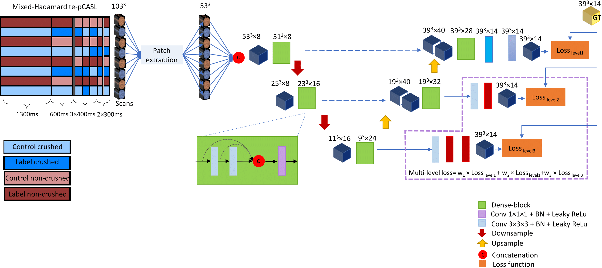
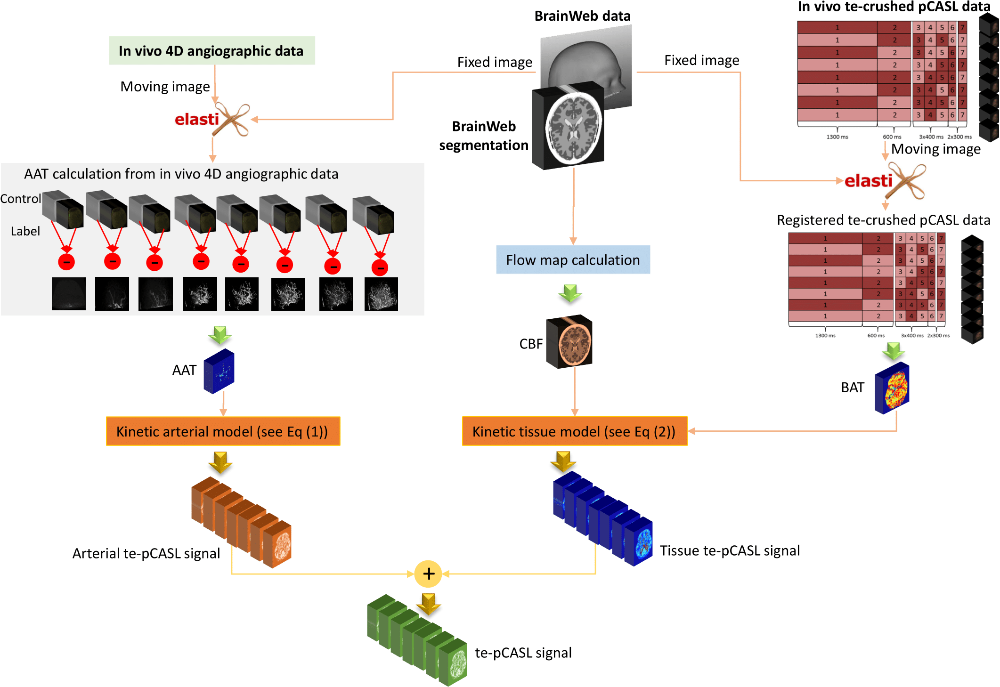
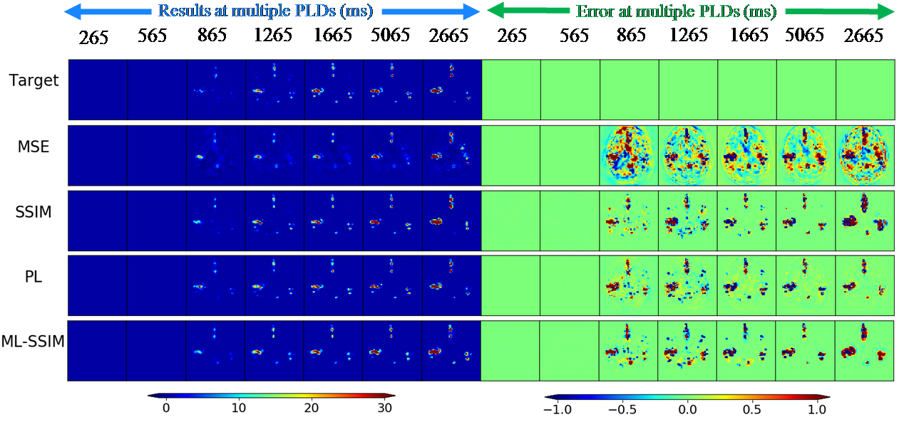
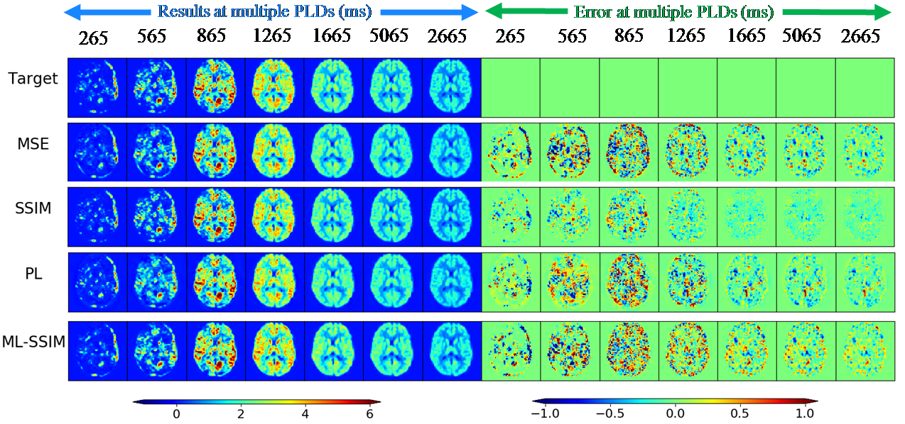

# Dynamic Angiography and Perfusion Reconstruction from Hadamard-te Arterial Spin Labeling of rank 8
# 1- Introduction
In this work 4D Angiography and Perfusion at eight time-points are reconstructed from an interleaved half-sampled crushed and non-crushed Hadamard-te arterial spin labeling (ASL) of rank 8. The network uses DenseUnet structure and multi-stage loss function. Different loss functions have been applied for training including: perceptual loss (PL), mean squre error (MSE), Structural Similarity Index (SSIM) in a single and multi-stage fasions. Also, a framework for generating dynamic ASL scans based on the Hadamard ASL kinetic model has been proposed. 

This process can be formulated as: 
,
in which  is the decoding and subtraction function,  and  are the acquired scans of the  row of non-crushed and crushed Hadamard te-pCASL datasets,  and  denote perfusion and angiography scans respectively. 

# 2- Citation
    @inproceedings{yousefi2019fast,
    title={Fast Dynamic Perfusion and Angiography Reconstruction using an end-to-end 3D Convolutional Neural Network},
    author={Yousefi, Sahar and Hirschler, Lydiane and van der Plas, Merlijn and Elmahdy, Mohamed S and Sokooti, Hessam and Van Osch, Matthias and Staring, Marius},
    booktitle={International Workshop on Machine Learning for Medical Image Reconstruction},
    pages={25--35},
    year={2019},
    organization={Springer}
    }

# 3- Proposed network

    
    <em>Figure 1- Proposed network, a multi-stage DenseUnet. Inputs: an interleaved half-sampled crushed and non-crushed Hadamard-te arterial spin labeling (ASL) of rank 8. Output: dynamic angiography and perdusion scans at 8 time-point.</em>

# 4- Proposed data generator

    
    <em>Figure 2- Proposed data generator.</em>

# 5- Results

    
    <em>Figure 3- Results of reconstructed angiography scans for one subject.</em>

    
    <em>Figure 4- Results of reconstructed perfusion scans for one subject.</em>

